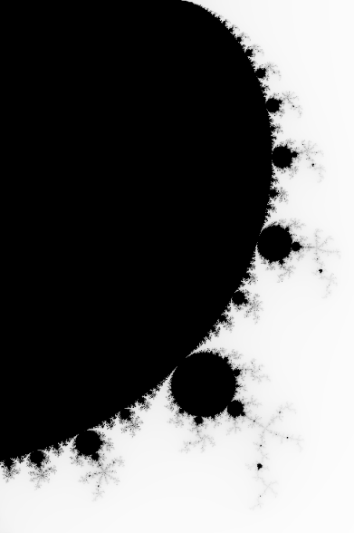

# Mandelbrot-Set image generater
This is a **Mandelbrot Set** image generater written in Rust.



### Features
- multi-threads support.
- `.png` format output.

### Running
```bash
cargo run output.png 100x100 -1.0,0.5 0.0,-0.5
```

### License
Licensed under the **MIT License**, read [LICENSE](LICENSE) for details.